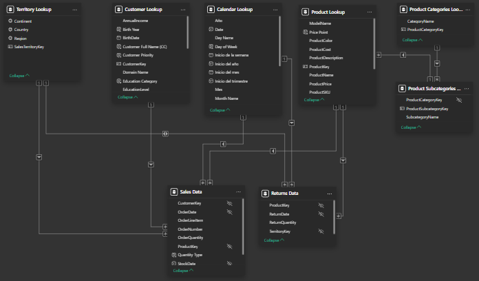
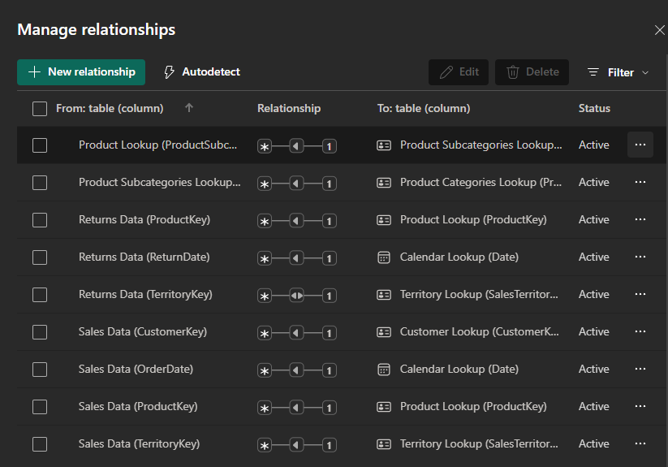
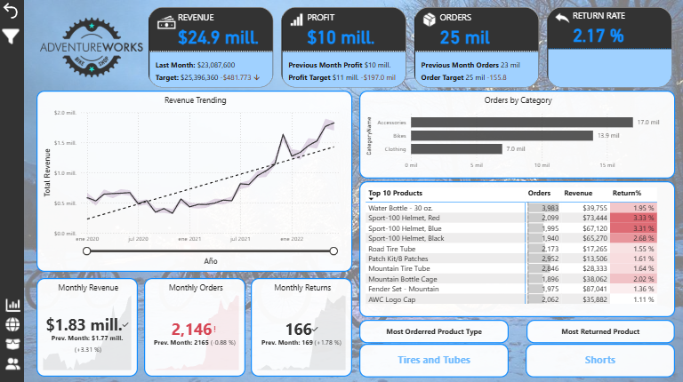
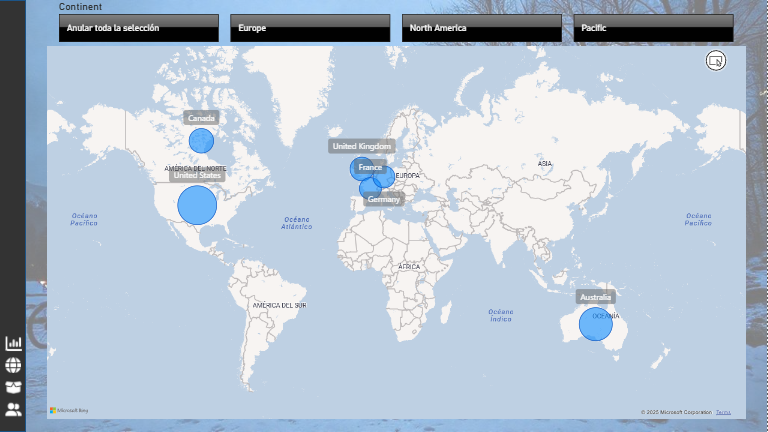
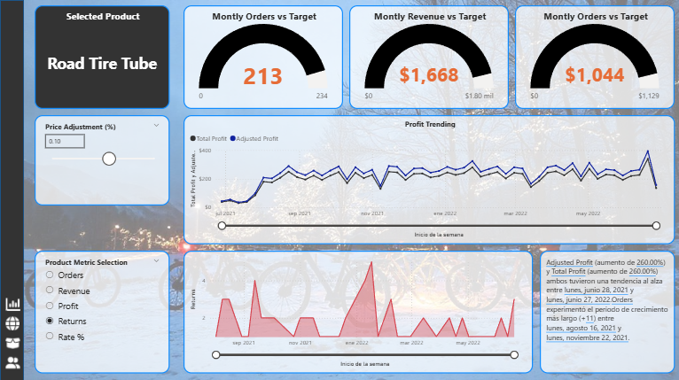
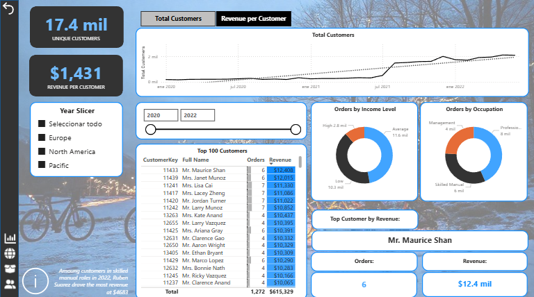

  

# AdventureWorks - Sales Dashboard

1. [Background Information 📖](#1-background-information)
2. [Data Import and Preparation 📂](#2-data-import-and-preparation)
3. [Data Cleaning and Transformation 🧹](#3-data-cleaning-and-transformation)
4. [Feature Creation and Analysis ⚙️](#4-feature-creation-and-analysis)
5. [Data Visualization 📈](#5-data-visualization)
6. [Dashboard Demo 🎬](#6-dashboard-demo)
7. [Key findings ⭐](#7-key-findings)
8. [Recommendations Based on Key Findings 💡](#8-recommendations-based-on-key-findings)

## **1. Background Information**📖

AdventureWorks is a fictional global manufacturer of cycling equipment and accessories, widely used for educational purposes in data analytics. This project simulates a real-world business intelligence scenario, where the analyst is tasked with transforming raw data into actionable insights for management.

### Business Task

The objective of this project is to help the management team monitor and analyze key performance indicators (KPIs) such as sales, revenue, profit, and returns. By comparing performance across regions, examining product trends, and identifying high-value customers, the analysis aims to support data-driven decision-making. Key deliverables include an interactive Power BI dashboard, visualizations highlighting trends, and recommendations to improve business performance and strategy.

### About the Data

The dataset consists of raw CSV files containing transaction and returns records, as well as product, customer, and sales territory information. These files were imported into Power BI Desktop and processed using **Power Query** for cleaning, filtering, and transformation. A relational data model was built, and calculated columns and measures were created using **DAX** to enable dynamic analysis and interactive reporting.

### Limitations

* Sample data: The provided CSVs are for educational purposes and may not fully reflect real-world business scenarios.  
* Data quality: Inconsistencies or missing values in the raw files could affect the analysis.  
* Limited scope: This project focuses on sales, products, and customer data; additional operational or financial datasets are not included.  
* Simulation environment: The analysis is conducted in a controlled, educational setting and does not capture the full complexity of a real AdventureWorks BI system.

## **2. Data Import and Preparation**📂

In this phase, all raw data files were imported into *Power BI Desktop* to prepare for analysis. The dataset included CSV files and folders containing Excel spreadsheets with detailed transaction, product, customer, and sales territory information.

Key steps performed during data import and preparation included:  
- Standardizing column names and correcting capitalization inconsistencies to ensure clarity and uniformity.  
- Splitting or combining columns as needed to create calculated fields for more granular analysis.  
- Creating new calculated columns to categorize products, customers, or transactions for better segmentation.  
- Organizing the imported tables to ensure they were clean, structured, and ready for subsequent data modeling and analysis.

These preparation steps ensured that the data was properly formatted, consistent, and structured to support the construction of a relational data model and the creation of dynamic measures in DAX.

## **3. Data cleaning and transformation**🧹

Once the raw data was imported and structured, extensive cleaning and transformation were performed to ensure accuracy and consistency across all tables.  

Key steps included:  
- Handling missing or blank values in all relevant columns to avoid errors in calculations and visualizations.  
- Removing duplicate records to maintain data integrity.  
- Correcting formatting issues, such as date formats, numeric precision, and text capitalization.  
- Rounding numeric values where appropriate to improve readability and consistency in reporting.  
- Merging related datasets, such as combining sales data, to create comprehensive tables for analysis.  
- Creating additional calculated columns to facilitate segmentation and categorical analysis, supporting deeper insights in later stages.

These steps ensured that the dataset was clean, reliable, and ready for advanced feature creation, modeling, and KPI calculations.

## **4. Feature creation and analysis**⚙️

Once the data was cleaned, the next step was to **design and model the relationships** between tables using Power BI’s *Manage Relationships* tool.  
This relational structure established the foundation for consistent aggregations and accurate cross-table analysis.

  
  

### Key Calculations and Measures
- **Sales KPIs:** Created measures for *Total Sales*, *Total Orders*, *Profit*, and *Return Rate* using DAX.  
- **Profit Margin:** Defined as `(Total Profit / Total Sales)` to evaluate performance by product and region.  
- **Period-over-Period Comparison:** Leveraged `CALCULATE()` and `DATEADD()` to compare key metrics against the previous month, 10 days prior, and 90 days prior, identifying short- and medium-term growth patterns.  

### Feature Creation
- **Customer Segmentation:** Defined customer segments by year and continent to assess regional sales dynamics and variations in purchasing behavior over time.
- **Regional Performance:** Built region-level aggregations to compare sales, profit, and growth metrics across markets and identify high-performing regions.
- **Product Analysis:** Classified products into categories and performance tiers based on revenue and profit margin contribution to highlight top and underperforming items.
- **Dynamic Parameters:** Implemented “What-if” parameters to simulate pricing adjustments and visualize their impact on overall profitability.

## **5. Data visualization**📈

Below are the main dashboards developed for this project, each designed to explore a different analytical dimension of the dataset.

- Sales Overview: Provides a global summary of key KPIs including Total Sales, Profit, and Return Rate, with interactive filters for period and region.
-	Regional Analysis: Compares performance by continent and country, highlighting top markets and growth opportunities.
-	Customer Insights: Shows customer segmentation by year and continent, tracking behavioral patterns and spending distribution.
-	Product Performance: Evaluates product categories by revenue and profit margin, identifying best-sellers and low-performing items.

  
  

  
  

## **6. Dashboard Demo** 🎬 

## **7. Key findings**

The analysis focused on sales performance, customer behavior, and product trends across multiple regions.
Key findings summarize the most relevant insights derived from the data, highlighting revenue growth, top-performing categories, and customer engagement patterns.
- **Overall Performance:** The business generated `$24.9M` in revenue and `$10M` in profit across `25K` orders, with a return rate of `2.17%`, indicating stable operational efficiency.
- **Growth Trend:** Revenue shows a consistent upward trend over the analyzed period, suggesting positive market performance.
- **Category Insights:** The Accessories category recorded the highest order volume `(17K orders)`, driven mainly by recurring purchases of Water Bottles, the top-selling product.
- **Product Performance:** Within product types, Tires and Tubes showed the strongest demand, highlighting their importance in overall sales mix.
- **Regional Distribution:** The United States led sales performance, followed by Australia, indicating strong engagement in North American and Oceanic markets.
- **Customer Insights:** The top customer, Maurice Shan, placed 6 orders totaling $12.4K in revenue, reflecting high-value individual purchasing behavior.

## **8. Recommendations Based on Key Findings**

After analyzing all the information presented in the dashboards, the following recommendations were determined based on the key findings:
- Focus on high-performing regions like the USA and Australia to reinforce marketing and distribution efforts.
- Expand the Accessories category, particularly Water Bottles, to capitalize on strong demand.
- Monitor Tire and Tube sales for potential product bundling or cross-selling opportunities.
- Strengthen customer retention strategies for top clients like Maurice Shan to increase long-term revenue.